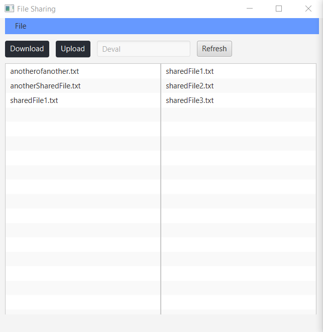

# CSCI 2020U Assignment #2: file-sharer
Written by Deval Panchal and Justin Wong

This program was written following the instructions of the document provided on the course Canvas page. 
It is a file-sharing program with a multi-threaded server, client-based UI, and downloading/uploading capabilities.
	
This is an image of the UI:

It features a download and upload button, display of the user's name (inputted on the command line), a directory refresh button,
and an option to exit or choose another shared directory (under the file tab).

# How to run this program on your device:

	IDE used: Intellij
	Version of Java used: 15.0.2
	Version of Gradle used: 6.6.1
	Version of JavaFX used: 15.0.1
	Linux VM Required (at least two terminals)

Step 1:

Clone the main branch of the repo, and rename the project folder "Assignment2" after extracting it.

Step 2:

Open the project folder in Inteliji and add your own JavaFX library to the project modules under "Module Settings".

Step 3:

Open the directory (cd to the location of the project folder) in a Linux VM of your choosing and run the server with the line:
	"gradle Server"
	
Step 4:

In a seperate terminal (also with the project folder as its specified directory) run the client UI with the line:
	"gradle run --args='ClientDownload/ *YourNameHere*'
	
